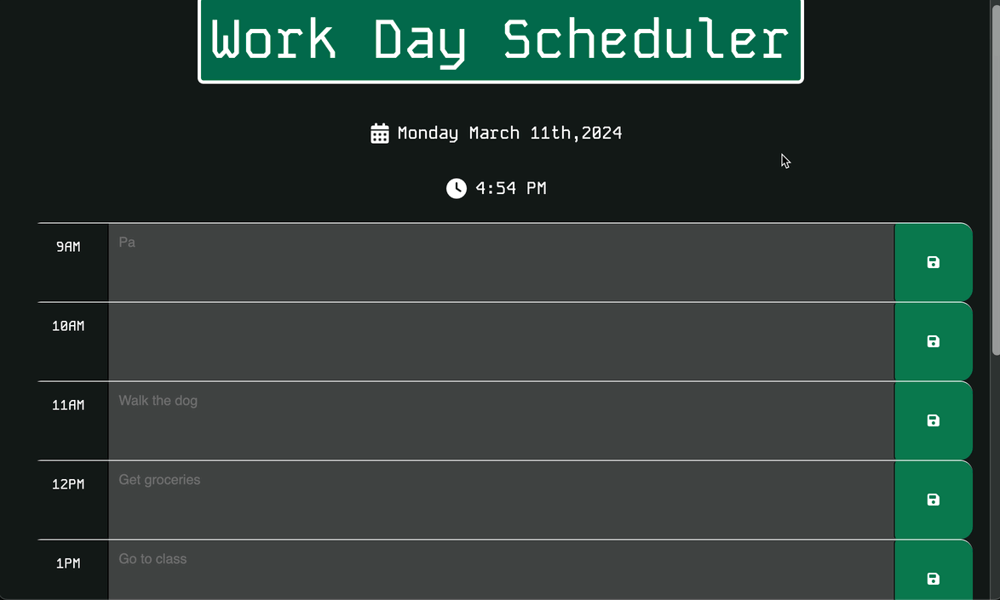
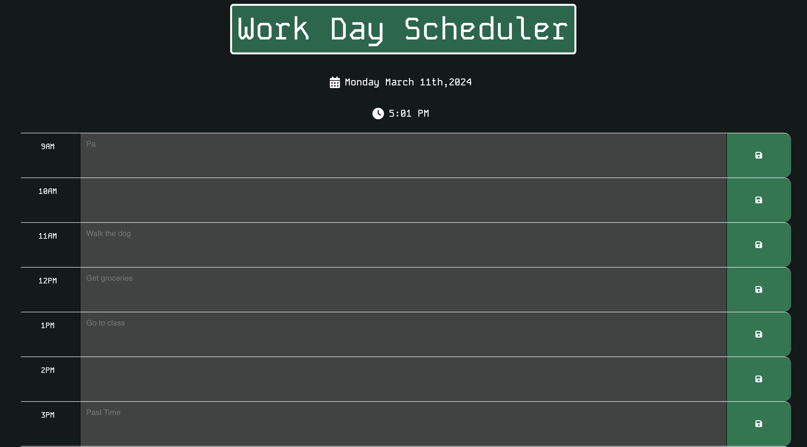

# Work Day Scheduler 

## Description

I created a calendar application that allows a user to schedule events from the hours of 9:00am-6:00pm. The events are saved in local storage once the save button is clicked and recalled once the page is loaded. The current date and time are also displayed at the top of the page. 

 I wanted to practice with third party APIs, and this project allowed me to work with dayjs. It also allowed me to practice more JavaScript. 

This project will help anyone structure their day for maximum results! Try it out!

## Table of Contents

- [Installation](#installation)
- [Usage](#usage)
- [Credits](#credits)
- [License](#license)

## Installation

This application is meant to be used in the browser here: https://chrisvulpine.github.io/work-day-scheduler/

## Usage

The user simply needs to click on the time block to add an event. After clicking the save button, the event will be saved to local storage. This allows the user to navigate away from the page, but still maintain the entered events. The calendar dynamically updates showing past time blocks, the present, and future time blocks. Each one has a unique color to help with identification and organization. 

   
   

   

## Credits

* For specifying an element inside an id: https://api.jquery.com/find/

* General Reference: https://www.w3schools.com/js/js_htmldom_eventlistener.asp

* Getting a value from a textarea in JQuery: https://www.w3docs.com/snippets/javascript/how-to-get-the-value-of-a-textarea-using-jquery.html#:~:text=To%20detect%20the%20value%20of,server%20when%20it%20is%20clicked

* JavaScript and Local Storage: https://blog.logrocket.com/localstorage-javascript-complete-guide/#:~:text=The%20setItem()%20method%20allows,the%20value%20attached%20to%20it

* Three branch if statement: https://developer.mozilla.org/en-US/docs/Web/JavaScript/Reference/Statements/if...else

* Adding a favicon: https://www.w3schools.com/html/html_favicon.asp 

* Button on Click CSS: https://www.geeksforgeeks.org/how-to-add-onclick-effect-using-css/

## License

N/A

---
## Badges

